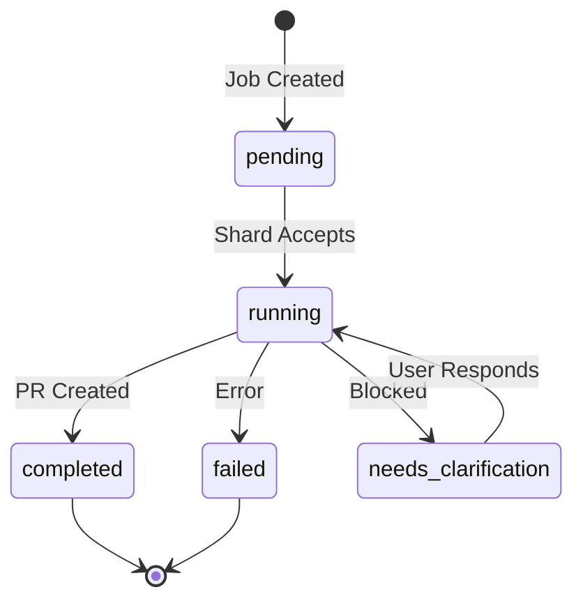

# AI Developer Pipeline

This document describes the processing pipeline for the AI Developer feature, which automatically implements Jira tickets using Claude Code CLI.

## Pipeline Overview

```mermaid
flowchart TD
    subgraph Trigger["1. TRIGGER"]
        A1[Jira Webhook<br/>issue_updated]
        A2[Manual UI Trigger<br/>Enterprise.php]
        A3[Script Trigger<br/>trigger-job.php]
    end

    subgraph Dispatch["2. JOB DISPATCH"]
        B1[AIDevJobService<br/>runForIssue]
        B2[Fetch Jira Issue<br/>summary, description, attachments]
        B3[Get Credentials<br/>Jira, GitHub, Anthropic]
        B4[Create Job Record<br/>AIDevStatusService::createJob]
        B5[Select Shard<br/>ShardRouter]
        B6[POST to Shard<br/>/analysis/shardaidev]
    end

    subgraph Shard["3. SHARD PROCESSING"]
        C1[shardaidev<br/>Analysis.php:869]
        C2[Return 202 Accepted<br/>Background processing]
        C3[preprocessAttachmentImages<br/>Download & resize with ImageMagick]
        C4[buildAIDevPrompt<br/>Construct Claude prompt]
        C5[runClaudeAIDev<br/>Execute Claude Code CLI]
    end

    subgraph Claude["4. CLAUDE CODE CLI"]
        D1[Clone Repository]
        D2[Read Jira Ticket]
        D3[View Attachments<br/>Pre-processed images]
        D4[Analyze Codebase]
        D5[Implement Changes]
        D6[Create Branch & PR]
    end

    subgraph PostProcess["5. POST-PROCESSING"]
        E1[pushThemeWithCLI<br/>Shopify theme push]
        E2{Playwright<br/>Verification?}
        E3[Iteration 1: Discovery<br/>Deep analysis]
        E4{Issues<br/>Found?}
        E5[runFixCycle<br/>Fix issues + JSON presets]
        E6[repushTheme<br/>Re-push to Shopify]
        E7[Iterations 2-4: Verify<br/>Visual confirmation]
        E8[uploadScreenshotsToJira<br/>Proof of work]
        E9[Post Jira Comment<br/>PR link, preview URL]
        E10[Callback to Main Server<br/>/webhook/aidev]
    end

    subgraph Callback["6. CALLBACK HANDLING"]
        F1[Webhook::aidev<br/>Webhook.php:779]
        F2[Update Job Status<br/>AIDevStatusService]
        F3[AIDevJobManager<br/>complete/fail]
        F4[Post Final Jira Comment]
        F5[Update Jira Status<br/>Remove label, transition]
    end

    A1 --> B1
    A2 --> B1
    A3 --> B1
    B1 --> B2 --> B3 --> B4 --> B5 --> B6
    B6 --> C1
    C1 --> C2
    C2 --> C3 --> C4 --> C5
    C5 --> D1 --> D2 --> D3 --> D4 --> D5 --> D6
    D6 --> E1
    E1 --> E2
    E2 -->|Yes| E3
    E2 -->|No| E9
    E3 --> E4
    E4 -->|Yes| E5
    E4 -->|No| E8
    E5 --> E6 --> E7
    E7 --> E4
    E8 --> E9
    E9 --> E10
    E10 --> F1 --> F2 --> F3 --> F4 --> F5
```



## Component Details

### 1. Trigger Layer

| Component | File | Description |
|-----------|------|-------------|
| Jira Webhook | `controls/Webhook.php` | Receives `issue_updated` events when `ai-developer` label is added |
| Manual Trigger | `controls/Enterprise.php` | UI button to manually start AI Dev job |
| Script Trigger | `scripts/trigger-job.php` | CLI script for testing/debugging |

### 2. Job Dispatch Layer

| Component | File | Description |
|-----------|------|-------------|
| AIDevJobService | `services/AIDevJobService.php:24` | Main orchestrator for job dispatch |
| runForIssue() | `services/AIDevJobService.php` | Fetches issue, builds payload, sends to shard |
| AIDevStatusService | `services/AIDevStatusService.php:10` | Manages job status in filesystem |
| ShardRouter | `services/ShardRouter.php` | Selects appropriate shard server |

**Payload sent to shard:**
```php
[
    'anthropic_api_key' => $apiKey,
    'job_id' => $jobId,
    'issue_key' => 'PROJ-123',
    'issue_data' => [
        'summary' => '...',
        'description' => '...',
        'comments' => '...',
        'attachment_info' => '...',
        'urls_to_check' => [...]
    ],
    'repo_config' => [
        'repo_owner' => '...',
        'repo_name' => '...',
        'clone_url' => '...'
    ],
    'jira_host' => '...',
    'jira_oauth_token' => '...',
    'github_token' => '...',
    'callback_url' => '/webhook/aidev',
    'shopify' => [...],
    'existing_branch' => null
]
```

### 3. Shard Processing Layer

| Component | File:Line | Description |
|-----------|-----------|-------------|
| shardaidev() | `controls/Analysis.php:869` | Entry point on shard |
| preprocessAttachmentImages() | `controls/Analysis.php:2009` | Downloads & resizes images with ImageMagick |
| buildAIDevPrompt() | `controls/Analysis.php:955` | Constructs the Claude prompt |
| runClaudeAIDev() | `controls/Analysis.php:1105` | Executes Claude Code CLI via proc_open |

**Image Preprocessing:**
- Downloads images from Jira using OAuth token
- Resizes images >500KB to max 1200px width
- Stores in `/tmp/aidev-job-{id}/attachments/`
- Updates prompt to reference local paths

### 4. Claude Code CLI Layer

Claude Code runs in `/tmp/aidev-job-{id}/repo/` with:
- `--print` for stdout logging
- `--dangerously-skip-permissions` for automation
- `--session-id` (UUID v5 from issue key) for context persistence

**Environment variables:**
```bash
ANTHROPIC_API_KEY=...
JIRA_API_TOKEN=...
GITHUB_TOKEN=...
HOME=/tmp/aidev-job-{id}
```

### 5. Post-Processing Layer

| Component | File:Line | Description |
|-----------|-----------|-------------|
| pushThemeWithCLI() | `controls/Analysis.php:1770` | Pushes Shopify theme via CLI |
| runPlaywrightVerification() | `controls/Analysis.php:1925` | 4-iteration visual QA verification loop |
| parseVerificationResult() | `controls/Analysis.php:2258` | Parses Claude output, detects credit errors |
| runFixCycle() | `controls/Analysis.php:2285` | Fixes issues found during verification |
| uploadScreenshotsToJira() | `controls/Analysis.php:2400` | Uploads proof screenshots to Jira |
| repushThemeForVerification() | `controls/Analysis.php:2350` | Re-pushes theme after fixes |
| postJiraComment() | (inline) | Posts PR/preview links to Jira |
| Callback | `controls/Analysis.php:1367` | POSTs result to main server |

**Playwright Verification Loop (4-Iteration Approach):**

When `shopify_verify_playwright` is enabled in enterprise settings, a 4-iteration verification process runs:

| Iteration | Phase | Purpose |
|-----------|-------|---------|
| 1 | **Discovery** | Deep analysis of what's implemented vs. missing. Identifies root causes. |
| 2-4 | **Fix/Verify** | Fix identified issues and verify they're resolved visually. |

**Key insight:** Shopify schema `default` values only apply to NEW sections. Existing sections have settings in `templates/*.json` or `config/settings_data.json`. The discovery phase identifies when JSON presets need modification.

```
┌─────────────────┐     ┌──────────────────────┐     ┌─────────────────┐
│  Push Theme     │ --> │  Iteration 1:        │ --> │  Issues Found?  │
│  to Shopify     │     │  DISCOVERY PHASE     │     │                 │
└─────────────────┘     │  - Deep code review  │     └────────┬────────┘
                        │  - Check JSON presets│               │
                        │  - Identify root cause│              │
                        └──────────────────────┘               │
                                                               │
                              ┌────────────────────────────────┤
                              │ Yes                            │ No
                              ▼                                ▼
                        ┌─────────────────┐           ┌─────────────────┐
                        │ Fix Issues:     │           │  PASSED!        │
                        │ - Modify code   │           │  Continue to    │
                        │ - Update JSON   │           │  Callback       │
                        │   presets       │           └─────────────────┘
                        └──────┬──────────┘
                               │
                               ▼
                        ┌─────────────────┐
                        │ Re-push Theme   │
                        └──────┬──────────┘
                               │
                               ▼
                        ┌──────────────────────┐
                        │ Iterations 2-4:      │ ─────┐
                        │ FIX/VERIFY PHASE     │      │
                        │ - Visual verification │     │
                        │ - Take screenshots   │      │
                        │ - "Do what it takes" │      │
                        └──────────────────────┘      │
                               ▲                      │
                               └──────────────────────┘
                                    (max 4 iterations, 8 min timeout each)
```

**Timeouts:**
- Each iteration: 8 minutes max
- Total verification: ~32 minutes max

**Enabling Playwright Verification:**
```sql
INSERT INTO enterprisesettings (setting_key, setting_value)
VALUES ('shopify_verify_playwright', '1');
```

**Credit Balance Alerts:**

If Anthropic API credits run low during verification, the system:
1. Detects "Credit balance is too low" errors in Claude output
2. Stores alert in `enterprisesettings` table (24-hour TTL)
3. Shows banner on Enterprise dashboard with link to Anthropic billing

### 6. Callback Layer

| Component | File:Line | Description |
|-----------|-----------|-------------|
| Webhook::aidev() | `controls/Webhook.php:779` | Receives completion callback |
| AIDevJobManager | `services/AIDevJobManager.php` | Updates job records |
| Jira Integration | (inline) | Posts final comment, removes label |

## Status Flow



## File Locations

### Main Server
```
/home/mfrederico/development/myctobot/
├── controls/
│   ├── Webhook.php          # Jira webhooks, callback handler
│   ├── Enterprise.php       # UI triggers
│   └── Analysis.php         # Shared, also used by shard
├── services/
│   ├── AIDevJobService.php  # Job dispatch
│   ├── AIDevStatusService.php # Status management
│   ├── AIDevJobManager.php  # Job completion
│   └── ShardRouter.php      # Shard selection
└── data/aidev/{member_id}/  # Job status files
```

### Shard Server (173.231.12.84)
```
/var/www/html/default/myctobot/
├── controls/
│   └── Analysis.php         # shardaidev(), Claude execution
└── log/
    └── shard-YYYY-MM-DD.log # Shard logs

/tmp/aidev-job-{job_id}/
├── prompt.txt               # Claude prompt
├── session.log              # Real-time output
├── session-info.json        # Job metadata
├── attachments/             # Pre-processed images
│   └── screenshot.png
├── repo/                    # Cloned repository
└── .claude/
    └── plugins -> /home/claudeuser/.claude/plugins
```

## Monitoring

```bash
# Watch shard log
ssh claudeuser@173.231.12.84 "tail -f /var/www/html/default/myctobot/log/shard-$(date +%Y-%m-%d).log"

# Watch specific job
ssh claudeuser@173.231.12.84 "tail -f /tmp/aidev-job-{JOB_ID}/session.log"

# List running jobs
ssh claudeuser@173.231.12.84 "ls -la /tmp/aidev-job-*/"
```

## Key Processing Points

1. **Image Optimization** (`Analysis.php:2009`)
   - Reduces context window usage
   - ImageMagick resize: `convert -resize "1200x>" -quality 85`

2. **Session Persistence** (`Analysis.php:1174`)
   - UUID v5 from issue key ensures same session across reruns
   - Enables "continue from where you left off" behavior

3. **Branch Affinity** (`AIDevJobService.php`)
   - Checks for existing branch for issue
   - Reuses branch instead of creating new one

4. **Shopify Theme Push** (`Analysis.php:1761`)
   - Uses `shopify theme push --unpublished`
   - Creates preview URL for QA

5. **Screenshot Upload to Jira** (`Analysis.php:2400`)
   - Uploads proof-of-work screenshots after verification
   - Filters to only `proof-*`, `before-*`, `after-*` prefixed images
   - Uses Jira Cloud REST API with OAuth token
   - Screenshots attached as evidence of visual verification

6. **Credit Balance Detection** (`Analysis.php:2258`, `Webhook.php:947`)
   - Detects "Credit balance is too low" during verification
   - Stores warning in `enterprisesettings` table
   - Shows alert banner on Enterprise dashboard for 24 hours

7. **4-Iteration Verification** (`Analysis.php:1925`)
   - Iteration 1: Discovery phase (deep analysis)
   - Iterations 2-4: Fix/verify cycles
   - 8-minute timeout per iteration
   - Understands Shopify JSON presets vs schema defaults
