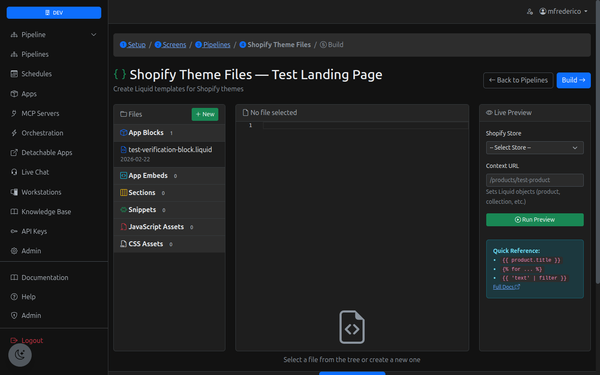
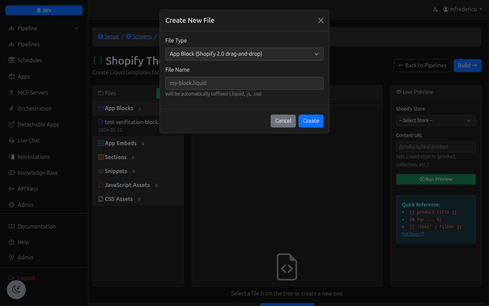
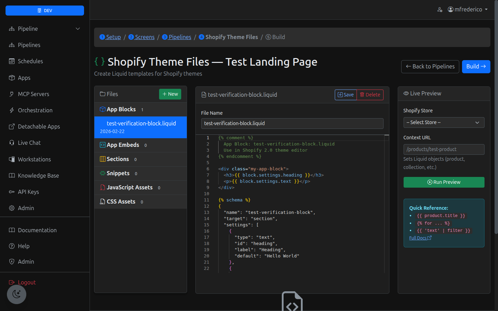
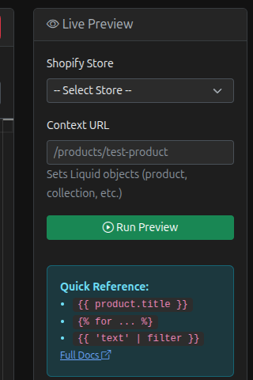

# Shopify Plugin Builder - User Manual

**Version:** 1.0
**Last Updated:** February 22, 2026
**Platform:** MyCTOBot Apps

---

## Table of Contents

1. [Introduction](#introduction)
2. [What You Can Build](#what-you-can-build)
3. [Getting Started](#getting-started)
4. [Creating Your First Plugin](#creating-your-first-plugin)
5. [File Types Explained](#file-types-explained)
6. [Using the Liquid Editor](#using-the-liquid-editor)
7. [Testing & Preview](#testing--preview)
8. [Shopify Liquid Quick Reference](#shopify-liquid-quick-reference)
9. [Best Practices](#best-practices)
10. [Troubleshooting](#troubleshooting)
11. [Next Steps: Deployment](#next-steps-deployment)

---

## Introduction

The Shopify Plugin Builder lets you create professional Shopify theme extensions using Liquid templates, JavaScript, and CSS. Your plugins will be installable via the Shopify App Store and can be dragged into any Shopify 2.0 theme using the theme editor.

**What makes this special:**
- **No coding required** for basic plugins (use our templates)
- **Live preview** against real store data
- **Monaco editor** with syntax highlighting
- **Auto-generated app bundles** ready for Shopify App Store
- **Built-in pipeline integration** for dynamic data

---

## What You Can Build

### App Blocks (Recommended for Beginners)
Drag-and-drop components that merchants add to their theme via the theme editor.

**Examples:**
- Product reviews widget
- Size chart selector
- Trust badges
- Countdown timers
- Social proof notifications
- Loyalty points display

### App Embeds
Global scripts that run on every page (use sparingly).

**Examples:**
- Analytics tracking
- Live chat widget
- Cookie consent banner
- Exit-intent popups

### Sections
Full-page layouts or major page components.

**Examples:**
- Custom landing pages
- Featured product carousels
- Hero banners
- Newsletter signup sections

### Snippets
Reusable components included by themes.

**Examples:**
- Star rating display
- Share buttons
- Product card templates
- Custom icons

### Assets
JavaScript and CSS files for your plugin.

**Examples:**
- `app.js` - Main plugin logic
- `app.css` - Plugin styles
- `widget.js` - Interactive components

---

## Getting Started

### Step 1: Access the Platform

1. **Login** to MyCTOBot at https://dev.myctobot.ai
2. **Navigate** to `/apps?target=shopify` from the sidebar (**Shopify Apps**)
3. **Click** "New App" (or select an existing app)


*The Apps dashboard showing your app list*

### Step 2: Basic App Setup

Fill out the app creation form:

- **App Name:** Display name (e.g., "Customer Reviews Pro")
- **Description:** What your plugin does
- **Slug:** Auto-generated from name (e.g., `customer-reviews-pro`)

**Important Settings:**
- **Shopify App Handle:** Must match your Shopify Partner app (create this later)
- **OAuth Scopes:** Permissions your app needs (e.g., `read_products,read_orders`)

Click **Save** to create your app.

### Step 3: Navigate to Shopify Theme Files

After creating your app, follow the breadcrumb navigation:

1. **Setup** ✓ (you just did this)
2. **Screens** → Skip for now (optional Stitch integration)
3. **Pipelines** → Skip for now (we'll come back to this)
4. **Shopify Theme Files** ← **Go here!**

Or directly visit: `/apps/liquidfiles/{your-app-id}`


*The main Liquid file editor with file tree (left), Monaco editor (center), and preview panel (right)*

---

## Creating Your First Plugin

Let's build a simple product review widget as an example.

### Step 1: Create an App Block File

1. **Click** the green **"New"** button in the file tree
2. **Select** file type: **"App Block (Shopify 2.0 drag-and-drop)"**
3. **Name** your file: `product-reviews`
4. **Click** "Create"


*Creating a new file with the file type selector*

The editor will open with a starter template.

### Step 2: Customize the Template

The default template looks like this:

```liquid

  App Block: product-reviews.liquid
  Use in Shopify 2.0 theme editor


<div class="my-app-block">
  <h3>{{ block.settings.heading }}</h3>
  <p>{{ block.settings.text }}</p>
</div>


{
  "name": "product-reviews",
  "target": "section",
  "settings": [
    {
      "type": "text",
      "id": "heading",
      "label": "Heading",
      "default": "Hello World"
    },
    {
      "type": "textarea",
      "id": "text",
      "label": "Text",
      "default": "This is my app block"
    }
  ]
}

```

### Step 3: Edit the Code

Replace the template with your custom code. Here's a real product review example:

```liquid

  Product Reviews Block
  Displays star ratings and customer reviews


<div class="product-reviews-widget">
  <div class="reviews-header">
    <h3>{{ block.settings.heading }}</h3>
    <div class="star-rating">
      
        <span class="star filled">★</span>
      
      <span class="rating-text">{{ block.settings.average_rating }} / 5</span>
    </div>
  </div>

  <div class="reviews-list">
    
      In a real app, this would fetch reviews from your pipeline
    
    <p>{{ block.settings.placeholder_text }}</p>
  </div>

  
    <button class="write-review-btn">{{ block.settings.cta_text }}</button>
  
</div>

<style>
  .product-reviews-widget {
    padding: 20px;
    border: 1px solid #e0e0e0;
    border-radius: 8px;
  }
  .star-rating .star {
    color: #ddd;
    font-size: 24px;
  }
  .star-rating .star.filled {
    color: #ffc107;
  }
  .write-review-btn {
    background: {{ block.settings.button_color }};
    color: white;
    padding: 10px 20px;
    border: none;
    border-radius: 4px;
    cursor: pointer;
  }
</style>


{
  "name": "Product Reviews",
  "target": "section",
  "settings": [
    {
      "type": "text",
      "id": "heading",
      "label": "Section Heading",
      "default": "Customer Reviews"
    },
    {
      "type": "range",
      "id": "average_rating",
      "label": "Average Rating",
      "min": 0,
      "max": 5,
      "step": 0.5,
      "default": 4.5
    },
    {
      "type": "textarea",
      "id": "placeholder_text",
      "label": "Placeholder Text",
      "default": "Reviews loading..."
    },
    {
      "type": "checkbox",
      "id": "show_cta",
      "label": "Show Write Review Button",
      "default": true
    },
    {
      "type": "text",
      "id": "cta_text",
      "label": "Button Text",
      "default": "Write a Review"
    },
    {
      "type": "color",
      "id": "button_color",
      "label": "Button Color",
      "default": "#000000"
    }
  ]
}

```

### Step 4: Save Your File

1. **Update** the filename in the input box if needed
2. **Click** the blue **"Save"** button
3. You'll see: **"File saved!"**
4. The file now appears in the **App Blocks** section of the file tree

---

## File Types Explained

### 1. App Blocks (.liquid)

**Best for:** Interactive widgets that merchants configure

**Location in theme:** Merchants drag from theme editor → Any section
**Settings:** Defined in `` block
**Template structure:**

```liquid
 Description 

<!-- Your HTML/Liquid here -->
<div>{{ block.settings.some_setting }}</div>


{
  "name": "Block Name",
  "target": "section",
  "settings": [
    {
      "type": "text",
      "id": "some_setting",
      "label": "Setting Label",
      "default": "Default value"
    }
  ]
}

```

**Available setting types:**
- `text`, `textarea`, `number`, `range`
- `checkbox`, `radio`, `select`
- `color`, `image_picker`, `url`
- `product`, `collection`, `blog`, `page`

### 2. App Embeds (.liquid)

**Best for:** Global scripts that run everywhere

**Location in theme:** Theme settings → App embeds
**Template structure:**

```liquid
 App Embed: widget.liquid 


(function() {
  // Your JavaScript here
  console.log('App loaded on every page');
})();

```

**⚠️ Use sparingly** - These run on every page and can affect performance.

### 3. Sections (.liquid)

**Best for:** Full-page layouts or major components

**Location in theme:** Theme editor → Sections
**Similar to App Blocks** but can be added as standalone sections.

### 4. Snippets (.liquid)

**Best for:** Reusable components

**Usage:** Other files include them: ``

**Example:**
```liquid
 Snippet: star-rating.liquid 

<div class="star-rating" data-rating="{{ rating }}">
  
    <span class="star filled">★</span>
  
</div>
```

### 5. JavaScript Assets (.js)

**Best for:** Complex interactivity

**Loaded via:** `{{ 'app.js' | asset_url | script_tag }}`

**Example:**
```javascript
// app.js
(function() {
  'use strict';

  // Fetch data from your MyCTOBot pipeline
  window.MyCTOBot = {
    async fetchReviews(productId) {
      const res = await fetch(`/apps/myctobot/customer-reviews/data/${productId}`);
      return res.json();
    }
  };

})();
```

### 6. CSS Assets (.css)

**Best for:** Plugin styles

**Loaded via:** `{{ 'app.css' | asset_url | stylesheet_tag }}`

**Example:**
```css
/* app.css */
.myctobot-widget {
  font-family: -apple-system, sans-serif;
  padding: 20px;
}

.myctobot-widget .btn-primary {
  background: #5c6ac4;
  color: white;
  border-radius: 4px;
}
```

---

## Using the Liquid Editor

### Editor Features


*Monaco editor with syntax-highlighted Liquid code, showing the schema JSON at the bottom*

**Monaco Editor** (same as VS Code):
- **Syntax highlighting** for Liquid, JavaScript, CSS
- **Auto-indent** and **bracket matching**
- **Multi-line editing** (Alt+Click)
- **Find & Replace** (Ctrl+F / Cmd+F)

### File Tree Navigation

**Left Panel:**
- Files organized by type
- Click any file to load it
- Active file highlighted in blue
- File count badges show how many files of each type

### Keyboard Shortcuts

| Action | Windows/Linux | Mac |
|--------|---------------|-----|
| Save file | Ctrl+S | Cmd+S |
| Find | Ctrl+F | Cmd+F |
| Replace | Ctrl+H | Cmd+H |
| Multi-cursor | Alt+Click | Opt+Click |
| Comment line | Ctrl+/ | Cmd+/ |
| Format | Shift+Alt+F | Shift+Opt+F |

### Editor Workflow

1. **Select or create** a file from the tree
2. **Edit** the code in the center panel
3. **Preview** in the right panel (see next section)
4. **Save** using the Save button or Ctrl+S
5. **Repeat** for additional files

---

## Testing & Preview

### Live Preview Feature


*The Live Preview panel with Shopify store selector and context URL input*

The **Live Preview** panel (right side) lets you test Liquid code against real Shopify store data.

### Setup for Preview

1. **Connect a Shopify Store:**
   - Go to `/connections` in MyCTOBot
   - Click "Add Connection" → Shopify
   - Authorize your store
   - Return to the Liquid editor

2. **Select Preview Store:**
   - Dropdown shows: "myctobot-dev" (or your store name)
   - Select the store to preview against

3. **Set Context URL:**
   - Enter a product URL: `/products/my-product-handle`
   - Or collection URL: `/collections/featured`
   - Or leave blank for global context

### Running a Preview

1. **Type or select** Liquid code in the editor
2. **Enter** a context URL (e.g., `/products/test-product`)
3. **Click** "Run Preview"
4. **View** the output in the preview panel

### Preview Examples

**Test product data:**
```liquid
{{ product.title }}
{{ product.price | money }}
{{ product.vendor }}
```

**Context:** `/products/leather-jacket`
**Output:**
```
Classic Leather Jacket
$299.00
Fashion Co
```

**Test collection loop:**
```liquid

  - {{ product.title }} ({{ product.price | money }})

```

**Context:** `/collections/featured`
**Output:**
```
- Denim Jeans ($89.00)
- Cotton T-Shirt ($29.00)
- Sneakers ($120.00)
```

### Preview Limitations

- **10-second timeout** - Complex queries may timeout
- **Read-only** - Preview doesn't modify store data
- **Liquid only** - JavaScript in templates won't execute in preview
- **No mutations** - Can't test cart modifications or checkout

---

## Shopify Liquid Quick Reference

### Common Variables

| Variable | Description | Example |
|----------|-------------|---------|
| `{{ product.title }}` | Product name | "Leather Jacket" |
| `{{ product.price }}` | Price in cents | 29900 |
| `{{ product.price \| money }}` | Formatted price | "$299.00" |
| `{{ product.vendor }}` | Brand/vendor | "Nike" |
| `{{ product.description }}` | Full description | "A classic..." |
| `{{ collection.title }}` | Collection name | "Summer Sale" |
| `{{ shop.name }}` | Store name | "My Store" |
| `{{ shop.currency }}` | Currency code | "USD" |

### Loops

```liquid

  <div>{{ product.title }}</div>



  {{ variant.title }} - {{ variant.price | money }}

```

### Conditionals

```liquid

  <button>Add to Cart</button>

  <span>Sold Out</span>



  <span class="premium">Premium</span>



  <div>{{ product.title }}</div>

```

### Filters

```liquid
{{ product.price | money }}                    → "$299.00"
{{ product.title | upcase }}                   → "LEATHER JACKET"
{{ product.description | strip_html }}         → Plain text
{{ product.description | truncate: 100 }}      → First 100 chars
{{ 'my-image.jpg' | asset_url }}              → Full URL
{{ 'app.js' | asset_url | script_tag }}       → <script src="...">
{{ 'now' | date: "%B %d, %Y" }}               → "February 22, 2026"
```

### Schema Settings

**Text input:**
```json
{
  "type": "text",
  "id": "heading",
  "label": "Heading Text",
  "default": "Welcome"
}
```

**Color picker:**
```json
{
  "type": "color",
  "id": "bg_color",
  "label": "Background Color",
  "default": "#ffffff"
}
```

**Image picker:**
```json
{
  "type": "image_picker",
  "id": "banner_image",
  "label": "Banner Image"
}
```

**Product picker:**
```json
{
  "type": "product",
  "id": "featured_product",
  "label": "Featured Product"
}
```

### Full Documentation

📖 **Official Shopify Liquid Docs:** https://shopify.dev/docs/api/liquid

---

## Best Practices

### 1. Start Simple

✅ **DO:** Start with a basic app block
❌ **DON'T:** Try to build everything at once

**Progression:**
1. Static HTML/CSS block
2. Add Liquid variables
3. Add settings schema
4. Add JavaScript (if needed)
5. Connect to pipelines (advanced)

### 2. Use Semantic Naming

✅ **GOOD:**
- File: `product-reviews.liquid`
- CSS class: `.product-reviews-widget`
- Setting ID: `show_author_name`

❌ **BAD:**
- File: `block1.liquid`
- CSS class: `.widget`
- Setting ID: `setting1`

### 3. Keep CSS Scoped

Prefix your CSS classes to avoid conflicts:

```css
/* GOOD - Scoped */
.myctobot-reviews {
  padding: 20px;
}
.myctobot-reviews .star {
  color: gold;
}

/* BAD - Global */
.widget {
  padding: 20px;
}
.star {
  color: gold;
}
```

### 4. Provide Good Defaults

Merchants should be able to install and use your block immediately:

```json
{
  "type": "text",
  "id": "heading",
  "label": "Section Title",
  "default": "Customer Reviews"  ← Good default
}
```

### 5. Test on Real Products

- Use **preview** with actual product URLs
- Test with products that have:
  - Long titles (30+ characters)
  - No images
  - Many variants (10+)
  - Out of stock status

### 6. Mobile-First Design

Most Shopify traffic is mobile. Use responsive CSS:

```css
.my-widget {
  padding: 20px;
}

@media (max-width: 768px) {
  .my-widget {
    padding: 10px;
  }
}
```

### 7. Performance Tips

- **Minimize JavaScript** - Heavy scripts slow page load
- **Lazy load images** - Use `loading="lazy"`
- **Avoid loops in loops** - Can timeout on large collections
- **Limit API calls** - Cache data when possible

### 8. Schema Best Practices

**Group related settings:**
```json
{
  "type": "header",
  "content": "Colors"
},
{
  "type": "color",
  "id": "bg_color",
  "label": "Background"
},
{
  "type": "color",
  "id": "text_color",
  "label": "Text"
}
```

**Provide helpful labels:**
```json
{
  "type": "range",
  "id": "max_reviews",
  "label": "Maximum Reviews to Display",
  "info": "Shows only the most recent reviews",
  "min": 1,
  "max": 20,
  "default": 5
}
```

---

## Troubleshooting

### "File saved!" doesn't appear

**Cause:** JavaScript error or network issue
**Fix:**
1. Open browser console (F12)
2. Look for red error messages
3. Refresh the page and try again

### Monaco editor doesn't load

**Cause:** CDN blocked or slow connection
**Fix:**
1. Check internet connection
2. Disable browser extensions
3. Try a different browser
4. Clear browser cache

### Preview shows "ERROR: CLI exited with code 1"

**Cause:** Shopify CLI not installed or invalid Liquid syntax
**Fix:**
1. Check your Liquid syntax for errors
2. Simplify the code and try again
3. Contact support if CLI issue persists

### Variables show as blank (e.g., `{{ product.title }}` → empty)

**Cause:** Wrong context URL or product doesn't exist
**Fix:**
1. Verify the context URL is correct (e.g., `/products/actual-handle`)
2. Check that product exists in your store
3. Try a different product URL

### "Connection not found" in preview

**Cause:** Shopify store not connected
**Fix:**
1. Go to `/connections`
2. Click "Add Connection" → Shopify
3. Authorize your store
4. Return to Liquid editor and select store from dropdown

### Changes don't appear in preview

**Cause:** Preview uses cached code
**Fix:**
1. Click "Run Preview" again
2. Refresh the page
3. Clear the preview panel by changing context URL

### Can't save file - "App ID required"

**Cause:** App wasn't properly created
**Fix:**
1. Go back to `/apps`
2. Verify your app exists in the list
3. Click the app to ensure it loads
4. Navigate to Liquid Files again

---

## Next Steps: Deployment

### What Happens When You Build

When you're ready to deploy your plugin, you'll:

1. **Click "Build"** in the breadcrumb navigation
2. The system generates:
   - `shopify.app.toml` (app configuration)
   - `extensions/theme-app-extension/` (all your Liquid files)
   - `assets/app.js` (generated JavaScript)
   - `pipelines/` (embedded pipelines for auto-install)
3. **Download** the complete Shopify app bundle as a `.zip`

### Preparing for Shopify App Store

1. **Create a Shopify Partner account** at https://partners.shopify.com
2. **Register your app** in Partner Dashboard
3. **Get API credentials** (API key & secret)
4. **Add credentials** to your app settings in MyCTOBot
5. **Upload** your app bundle using Shopify CLI
6. **Submit** for App Store review

### Local Testing (Before Submission)

1. **Install Shopify CLI:** `npm install -g @shopify/cli`
2. **Navigate to your app bundle:** `cd downloaded-app-bundle`
3. **Run local dev:** `shopify app dev`
4. **Install on dev store** and test
5. **Fix any issues** and rebuild

### App Proxy Setup

Your app needs an **app proxy** to fetch dynamic data:

- **Proxy URL:** `https://myctobot.ai/apps/myctobot/proxy`
- **Subpath:** Your app slug (e.g., `/customer-reviews`)
- **Full proxy:** `https://myctobot.ai/apps/myctobot/customer-reviews`

This is configured automatically in the build process.

---

## Support & Resources

### Getting Help

- **Documentation:** https://dev.myctobot.ai/docs
- **Support:** Email support@myctobot.ai
- **Community:** Join our Discord (link in dashboard)

### External Resources

- **Shopify Liquid Docs:** https://shopify.dev/docs/api/liquid
- **Shopify App Guide:** https://shopify.dev/docs/apps
- **Theme Extension Guide:** https://shopify.dev/docs/apps/online-store/theme-app-extensions
- **Shopify Partner Blog:** https://www.shopify.com/partners/blog

### Example Apps

Check out these examples in the app gallery:

- **Product Reviews Widget** - Basic app block with settings
- **Size Chart Selector** - Advanced block with JavaScript
- **Loyalty Points Display** - Pipeline integration example
- **Customer Support Chat** - App embed with real-time data

---

## Appendix: Common Plugin Templates

### Template 1: Simple Trust Badge

```liquid
 Trust Badge Block 

<div class="trust-badge">
  
    
  
  <h4>{{ block.settings.heading }}</h4>
  <p>{{ block.settings.description }}</p>
</div>

<style>
  .trust-badge {
    text-align: center;
    padding: 20px;
    background: {{ block.settings.bg_color }};
    border-radius: 8px;
  }
</style>


{
  "name": "Trust Badge",
  "target": "section",
  "settings": [
    {
      "type": "checkbox",
      "id": "show_icon",
      "label": "Show Icon",
      "default": true
    },
    {
      "type": "image_picker",
      "id": "icon_url",
      "label": "Badge Icon"
    },
    {
      "type": "text",
      "id": "heading",
      "label": "Heading",
      "default": "Secure Checkout"
    },
    {
      "type": "textarea",
      "id": "description",
      "label": "Description",
      "default": "Your data is safe with us"
    },
    {
      "type": "color",
      "id": "bg_color",
      "label": "Background Color",
      "default": "#f5f5f5"
    }
  ]
}

```

### Template 2: Countdown Timer

```liquid
 Sale Countdown Timer 

<div class="countdown-timer" data-end="{{ block.settings.end_date }}">
  <h3>{{ block.settings.heading }}</h3>
  <div class="timer">
    <span class="days">00</span>d
    <span class="hours">00</span>h
    <span class="minutes">00</span>m
    <span class="seconds">00</span>s
  </div>
</div>

<style>
  .countdown-timer {
    text-align: center;
    padding: 30px;
    background: {{ block.settings.bg_color }};
  }
  .timer {
    font-size: 32px;
    font-weight: bold;
    color: {{ block.settings.text_color }};
  }
</style>


(function() {
  const timer = document.querySelector('.countdown-timer');
  const endDate = new Date(timer.dataset.end).getTime();

  function updateTimer() {
    const now = new Date().getTime();
    const distance = endDate - now;

    if (distance < 0) {
      timer.style.display = 'none';
      return;
    }

    const days = Math.floor(distance / (1000 * 60 * 60 * 24));
    const hours = Math.floor((distance % (1000 * 60 * 60 * 24)) / (1000 * 60 * 60));
    const minutes = Math.floor((distance % (1000 * 60 * 60)) / (1000 * 60));
    const seconds = Math.floor((distance % (1000 * 60)) / 1000);

    timer.querySelector('.days').textContent = String(days).padStart(2, '0');
    timer.querySelector('.hours').textContent = String(hours).padStart(2, '0');
    timer.querySelector('.minutes').textContent = String(minutes).padStart(2, '0');
    timer.querySelector('.seconds').textContent = String(seconds).padStart(2, '0');
  }

  updateTimer();
  setInterval(updateTimer, 1000);
})();



{
  "name": "Sale Countdown",
  "target": "section",
  "settings": [
    {
      "type": "text",
      "id": "heading",
      "label": "Heading",
      "default": "Sale Ends In:"
    },
    {
      "type": "text",
      "id": "end_date",
      "label": "End Date & Time",
      "info": "Format: 2026-12-31T23:59:59",
      "default": "2026-12-31T23:59:59"
    },
    {
      "type": "color",
      "id": "bg_color",
      "label": "Background Color",
      "default": "#ff0000"
    },
    {
      "type": "color",
      "id": "text_color",
      "label": "Text Color",
      "default": "#ffffff"
    }
  ]
}

```

### Template 3: Product FAQ

```liquid
 Product FAQ Block 

<div class="product-faq">
  <h3>{{ block.settings.heading }}</h3>

  <details class="faq-item">
    <summary>{{ block.settings.q1 }}</summary>
    <p>{{ block.settings.a1 }}</p>
  </details>

  
  <details class="faq-item">
    <summary>{{ block.settings.q2 }}</summary>
    <p>{{ block.settings.a2 }}</p>
  </details>
  

  
  <details class="faq-item">
    <summary>{{ block.settings.q3 }}</summary>
    <p>{{ block.settings.a3 }}</p>
  </details>
  
</div>

<style>
  .product-faq {
    padding: 20px;
  }
  .faq-item {
    border-bottom: 1px solid #eee;
    padding: 15px 0;
  }
  .faq-item summary {
    font-weight: bold;
    cursor: pointer;
  }
  .faq-item p {
    margin-top: 10px;
    color: #666;
  }
</style>


{
  "name": "Product FAQ",
  "target": "section",
  "settings": [
    {
      "type": "text",
      "id": "heading",
      "label": "FAQ Heading",
      "default": "Frequently Asked Questions"
    },
    {
      "type": "header",
      "content": "Question 1"
    },
    {
      "type": "text",
      "id": "q1",
      "label": "Question",
      "default": "What is your return policy?"
    },
    {
      "type": "textarea",
      "id": "a1",
      "label": "Answer",
      "default": "We offer 30-day returns on all items."
    },
    {
      "type": "header",
      "content": "Question 2 (Optional)"
    },
    {
      "type": "text",
      "id": "q2",
      "label": "Question"
    },
    {
      "type": "textarea",
      "id": "a2",
      "label": "Answer"
    },
    {
      "type": "header",
      "content": "Question 3 (Optional)"
    },
    {
      "type": "text",
      "id": "q3",
      "label": "Question"
    },
    {
      "type": "textarea",
      "id": "a3",
      "label": "Answer"
    }
  ]
}

```

---

## Changelog

**v1.0 (February 22, 2026)**
- Initial release
- Monaco editor integration
- Live preview feature
- Six file types supported
- Template scaffolding

---

**Questions?** Contact support@myctobot.ai or visit https://dev.myctobot.ai/docs

**Happy Building! 🚀**
